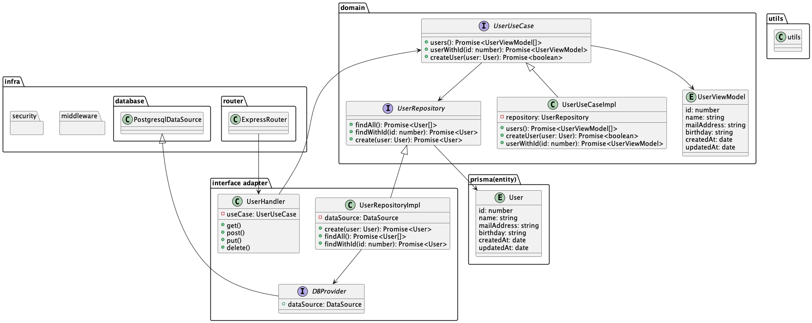

# express-api-boilerplate(クリーンアーキテクチャ)

Node.js(Express)を用いてAPI実装をする際の設計としてクリーンアーキテクチャを提案します。  
Expressはディレクトリ構成などを強制するフレームワークではなく、実装者によってバラツキが発生しやすいため、ソフトウェア構成に一定のルールを定めます


## クリーンアーキテクチャとは


### 概要
クリーンアーキテクチャは Robert C. Martin( 通称ボブおじさん ) によって提唱されたアーキテクチャパターンです。
クリーンアーキテクチャは**あるシステムの1機能を実現するアプリケーションを考えるとき、その実現する機能の領域(ドメイン)と技術の詳細に注目し、アプリケーションを4つの層に分けます。**

### それぞれのレイヤー
| 用語                     | 意味                                    |
|------------------------|---------------------------------------|
| Entities               | データ構造やメソッドの集合体                        |
| UseCases (domain)      | アプリケーション固有のビジネスロジック                   |
| Interface Adapter      | 円の内外に合わせてデータやイベントを変換し、 内側と外側のレイヤーとを繋ぐ |
| Frameworks and Drivers | 特定の条件下でのみ有効なコード。FW,DBなどが該当            |

### Entity
Entity は**処理の方法に依存しない( どんな処理がされるのかは知らない )データ構造やメソッドの集合体**となります。外側の層には依存しないため、Use Case や他の層によってどのように使われるかを気にしません。 
つまり**複数アプリケーションで共有可能で、外部変化( 機能追加など )による影響がないもの**だけが存在することになります。

### UseCase
UseCase は Entity を使って**アプリケーション固有のビジネスロジックを実現します。** 
また、UseCase層には**入出力のための出入口(ポート)**は存在しますが、そのポートにどのような経路から入力があって、どこへ出力するのかは知りません。

### Interface Adapter

Interface Adapter は**円の内外に合わせてデータやイベントを変換する**ためのレイヤーです。
Entity を UI で表示するようのデータに変換したり **内側と外側のレイヤーとを繋ぐ役割**をこなします。Presenter や Repository( Gateway ) と言ったものがこの層に属します。

### Presenter(handler)
Presenter は UseCase で取得したデータを View( UI ) に伝えたり、逆に View からイベントの通知を受け取り UseCase に伝える、View( UI ) と UseCase を繋ぐ役割をこなします。

### Repository(Gateway)
Repository は API への通信処理や DB の操作などの処理を隠蔽するためのもので、一般的には [Repository パターン](https://qiita.com/mikesorae/items/ff8192fb9cf106262dbf)と呼ばれるものです。UseCase は Repository を介して API への通信処理を行います。

### Frameworks and Drivers
Frameworks and Driver には特定の条件下でのみ有効なコードが集まります。
UI( View )、データベース、Web API クライアント( APIClient )などが該当します。どれも実装の詳細で、環境や顧客の要求変化にもっとも影響を受けます。

### SOLID原則

クリーンアーキテクチャの実装にはSOLID原則と呼ばれる原則を用います。

この中でクリーンアーキテクチャにおいて重要である

**D (Dependency Inversion)　依存性逆転の原則**

のみ詳しく解説します。

その他詳しくは下記で解説されているため合わせて参照してください。
https://qiita.com/baby-degu/items/d058a62f145235a0f007

- S (Single Responsibility)　単一責任の原則
- O (Open-Closed)　オープン・クローズドの原則
- L (Liskov Substitution)　リスコフの置換原則
- I (Interface Segregation)　インターフェイス分離の原則
- **D (Dependency Inversion)　依存性逆転の原則**


### ルール

**内側の円は外側の円からのみ参照される** というルールがあります。

例として Express(View) は Handler(Presenter) を知っていて、Handler は UseCase を知っています。 対して UseCase は Repository もしくは Handler を直接知ることはできません。

これを前提にした上で実際に **APIが呼ばれたタイミングでDBからユーザー情報を取得し、結果をレスポンスする** という操作について考えてみます。

以下のような順番で処理が進んでいきます。

1. Express が Handler にAPIリクエストされたことを通知します。
2. Handler は UseCase に「ユーザー情報を取得すること」を通知します。
3. UseCase は 実際の処理は知らないので、実際の処理を取りまとめた Repository に「処理を行う」ように通知します。ここで**依存の関係は逆**になります。


### 依存関係逆転の原則( DIP )

このように実際の場面では逆方向に参照したい場合があります。 

そこで出てくるのが **依存関係逆転の原則( Dependency Inversion Principle )** で、 クリーンアーキテクチャのルールを守ったまま逆方向の参照を実現するものです。

### 依存関係逆転の原則( DIP )について

- **上位レベルのモジュールは下位レベルのモジュールに依存すべきではない。 両方とも抽象に依存すべきである。**
- **抽象は詳細に依存してはならない。詳細が抽象に依存すべきである。**


## サンプル実装について
クリーンアーキテクチャの原則を踏まえサンプル実装を行いました。
### UML

### 構成
```sh
├── src
│   ├── adapter # Interface Adapter層
│   │   ├── gateway # repositoryの実装を行う
│   │   │   └── user_repository.ts
│   │   └── handler # HTTPリクエストを受け、レスポンスを返す 
│   │       └── user_handler.ts
│   │   └── provider # DBアクセスのインターフェース定義を行う 
│   │       └── db_provider.ts
│   ├── domain # Domain層
│   │   ├── interactor # usecaseの実装を行う
│   │   │   └── user_usecase.ts
│   │   └── usecase # usecaseのインターフェース定義を行う
│   │       └── user_usecase.ts
│   │   └── repository # repositoryのインターフェース定義を行う
│   │       └── user_repository.ts
│   │   └── model # 表示用データモデルの定義を行う
│   │       └── user_repository.ts
│   ├── entity # Entity層
│   │   ├── entity # データエンティティ定義を行う
│   │   │   └── user.ts
│   ├── infra # Infrastructure層
│   │   ├── database # Database接続の実装を行う
│   │   │   ├── mysql_datasource.ts
│   │   └── router # Expressの実装を行う
│   │       └── router.ts
│   └── main.ts # メインファイル Expressの実行を行う

```
### 各レイヤーの責務

#### entity
ユーザー情報を表現するユーザーテーブルをentityとして表現します。

> src/entity/user.ts

```typescript
@Entity()
export class User {
  @PrimaryGeneratedColumn()
  id: number

  @Column()
  name: string
  // ...
}
```

#### usecase
UseCase はDIPを利用してRepository のインターフェースを参照し、処理の実行を Repository に任せるような作りになっています。

> src/domain/usecase/user_usecase.ts

```typescript
// handler側に公開するUseCaseインターフェース
export interface UserUseCase {
  users(): Promise<UserModel[]>
  userWithId(id: number): Promise<UserModel>
  createUser(user: User): Promise<boolean>
}
```

> src/domain/interactor/user_usecase.ts

```typescript
// UseCaseインターフェースに準拠した実装クラス
export class UserUseCaseImpl implements UserUseCase {
  private repository: UserRepository
  constructor(repository: UserRepository) {
    this.repository = repository
  }

  async users(): Promise<User[]> {
    return await this.repository.findAll()
	}
	// ...
}
```

#### handler
UseCaseで取得したデータをExpressに伝えたり、逆にExpressからリクエストを受け取り UseCase に伝える、Expressと UseCase を繋ぐ役割をこなします。

> src/adapter/user_handler.ts

```typescript
export default function UserHandler(useCase: UserUseCase) {
  const router = express.Router()

  router.get('/', async (req: Request, res: Response) => {
    try {
      const users = await useCase.users()
      res.send(users)
    } catch (err) {
      console.error(err)
      res.status(500).send({ message: 'Error fetching data' })
    }
  })
  // ...
}
```
#### repository
Repositoryはデータの取得、永続化に関する処理を実装します。
インターフェースはdomain層、実装はadapter層に位置し、DIPを利用してクリーンアーキテクチャの原則を守ります。

> src/domain/repository/user_repositorty.ts

```typescript
// usecase側に公開するUseCaseインターフェース
export interface UserRepository {
  findAll(): Promise<User[]>
  findWithId(id: number): Promise<User>
  create(user: User): Promise<User>
}
```

> src/adapter/gateway/user_repositorty.ts

```typescript
// repositoryインターフェースに準拠した実装クラス
export class UserRepositoryImpl implements UserRepository {
  private readonly dataSource: DataSource
  constructor(dataSource: DataSource) {
    this.dataSource = dataSource
  }

  async create(user: User): Promise<User> {
    return this.dataSource.getRepository(User).create(user)
  }
	// ...
}
```

### 起動スクリプト

下記コマンドでサンプルプログラムの実行を行います。

DBはdocker-composeで立ち上げたMySQLに接続するものになっています。

1. Run `yarn` command
2. Run `docker-compose up -d` command
3. Run `yarn start` command

---

> 下記URLの記事たちを元に検討・設計・実装しました

https://gist.github.com/mpppk/609d592f25cab9312654b39f1b357c60

https://qiita.com/nrslib/items/a5f902c4defc83bd46b8

https://blog.tai2.net/the_clean_architecture.html

https://github.com/android10/Android-CleanArchitecture

https://github.com/bxcodec/go-clean-arch

https://github.com/sergdort/CleanArchitectureRxSwift

https://www.shoeisha.co.jp/book/detail/9784798121963
